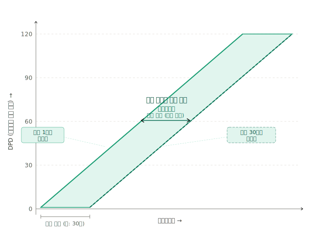
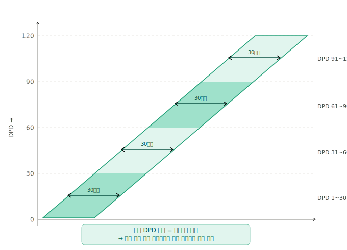
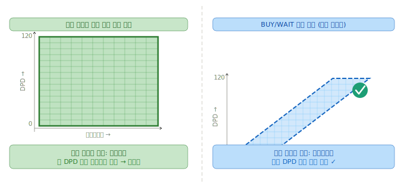

# v0.3 Baseline — 주제 흐름 및 설계 근거

---

## 1. 문서 목적

본 문서는 프로젝트의 주제 흐름, 핵심 설계 결정, 그리고 각 결정의 판단 근거를 정리한다.
설계 판단이 흔들릴 경우 이 문서를 기준으로 재확인한다.

---

## 2. 프로젝트 핵심 방향

### 2-1. 문제 정의

항공권 가격은 동일 노선·동일 출발일이더라도 구매 시점에 따라 다르게 형성된다.
소비자는 지금 살지, 나중에 살지를 판단할 정보가 부족한 상태에서 구매 결정을 내린다.

본 프로젝트는 이 의사결정을 보조하는 것을 목적으로 한다.

### 2-2. 접근 방식

절대 가격 예측보다 **관측된 가격의 위치와 분포를 해석**하여 구매/관망을 권고하는 방식을 채택한다.

- 문제 유형: BUY or WAIT 이진 분류
- 핵심 변수: DPD (Days to Departure, 출발까지 남은 일수)
- 라벨 생성: 사후적 비교 (관측 시점 가격 vs 이후 가격 변화)

### 2-3. 참조 연구

**학술 근거**

| 논문 | 핵심 기여 |
|---|---|
| Groves & Gini (2013/2015) | DPD 기반 BUY/WAIT 에이전트 설계, lagged feature 활용 |
| Domínguez-Menchero et al. (2014) | 비모수 등방회귀 기반 구매 임계점 도출 |
| Cao & Xu (2021) | PACES 전략, 불확실성 처리 |
| Abdella et al. (2021) | 서베이 논문, 공통 feature 패턴 정리 |
| Korkmaz (2024) | 다중공선성 주의사항 |

**산업·서비스 참고 근거**

| 출처 | 내용 |
|---|---|
| ARC (Airline Reporting Corporation, 2014) | 약 57일 전 예약이 최적 구매 시점 |
| CheapAir.com — 13억 건 운임 분석 | 최적 구간은 출발 21~112일 전 |
| Going.com (국제선 기준) | 국제선 최적 구간은 출발 2~8개월 전 |
| Bulchand-Gidumal et al. (2021, PMC) | 레저 여행자는 가격 민감도 높고 선행 구매 구조에 반응 |

---

## 3. 데이터 구조 이해 — 평행사변형 구조

### 3-1. 수집 구조 개요

매일 수집을 반복하면 수집 데이터는 아래 구조로 쌓인다.

- X축: 출발 예정일
- Y축: DPD (수집 당일 기준 출발까지 남은 일수)
- 각 셀: 해당 출발일에 해당 DPD에서 관측한 가격

수집 시작일로부터 시간이 지남에 따라 전체 관측 영역은 평행사변형 형태로 형성된다.

### 3-2. 평행사변형 구조의 의미

수집 기간이 30일이라고 가정할 때, DPD 120에서 시작한 출발일은 수집 종료 시점에 DPD 90 근처까지 관측된다. 즉 어떤 출발일도 전체 DPD 구간을 완전히 커버하지 못한다.

그러나 **DPD 기준으로 집계**하면 다음이 성립한다.

- 수집 기간 전체에 걸쳐 각 DPD 구간은 동일한 수의 출발일에서 관측됨
- 특정 DPD 구간이 다른 구간보다 과도하게 많거나 적게 나타나지 않음

### 3-3. BUY/WAIT 모델 관점에서의 해석

BUY/WAIT 모델은 DPD 기준 가격 패턴을 학습하는 것이 목적이므로, 평행사변형 전체를 학습 데이터로 활용할 수 있다.

단, 아래 제한은 인지하고 진행한다.

- DPD 축 기준의 로컬 의사결정 학습에는 활용 가능
- 출발월·계절성·캘린더 효과와의 분리는 현재 수집 구조만으로 제한적
- 전체 가격 곡선 복원이나 월별 일반화에는 부적합

> 특정 출발일의 전체 가격 곡선 분석이 목적이라면 직사각형 구간 사용이 필요하다. 현재 단계에서는 해당 분석이 목적이 아니므로 적용하지 않는다.

---

## 4. DPD 상한 120일 근거

### 4-1. 결정 사항

**DPD 상한: 120일 (확정)**

### 4-2. 학술 근거

| 출처 | 내용 |
|---|---|
| Domínguez-Menchero et al. (2014) | 유의미한 가격 상승 없이 구매를 미룰 수 있는 임계점은 25~30 DPD 수준. 핵심 의사결정 구간은 0~30 DPD. |
| Groves & Gini (2013) | 60~90 DPD 내 유의미한 가격 변동 신호 관측. DPD 기반 패턴 학습의 유효 구간으로 제시. |

학술적으로 핵심 의사결정 구간은 DPD 30~90 수준이다.

### 4-3. 산업·서비스 참고 근거

| 출처 | 내용 |
|---|---|
| ARC 데이터 (2014) | 약 57일 전 예약이 최적 구매 시점. 2개월 선행 구간이 핵심. |
| CheapAir.com 분석 | 최적 구간은 출발 21~112일 전. 출발 0~13일 전은 평균 75~200달러 추가 비용 발생. |
| Going.com (국제선 기준) | 국제선 최적 구간은 출발 2~8개월 전. 60~90일 내에 유의미한 저점 형성. |

### 4-4. 120일 선택 이유

학술 근거는 30~90 DPD를 핵심 구간으로 제시하며, 산업 데이터는 국제선에서 90일을 초과하는 선행 구매 행동도 일부 존재함을 보여준다. 120일은 이 두 근거를 포괄하면서 수집 비용(크레딧 소모)과 분석 유효성의 균형점으로 설정했다.

366일 상한은 실제 의사결정과 관계없는 구간을 대량 포함하므로 수집 비용 대비 분석 가치가 낮다.

---

## 5. 왕복 7일 고정 근거

### 5-1. 결정 사항

**왕복 체류 기간: 7일 고정 (확정)**

### 5-2. 핵심 논리

왕복 항공권 가격은 단순히 편도 2개의 합이 아니다. 항공사 수익관리 시스템은 체류 기간을 독립 가격 결정 변수로 처리한다. 즉, 동일 출발일이라도 3박/7박/14박 왕복 가격이 서로 다르게 형성된다.

따라서 왕복 데이터에서 DPD 단독 효과를 측정하려면, 체류 기간이 혼입 변수(confounding variable)가 된다.

체류 기간을 고정하지 않으면 다음을 분리할 수 없다.

- DPD가 낮아져서 가격이 변화한 것인지
- 체류 기간 조합이 달라져서 가격이 변화한 것인지

따라서 **체류 기간 고정은 선호의 문제가 아니라, DPD 효과 측정을 위한 필수 조건 통제**이다.

### 5-3. 7일을 선택한 이유

| 기준 | 내용 |
|---|---|
| 요일 효과 통제 | 7일 고정 시 출발 요일 = 귀국 요일이 되어 요일 효과가 양방향 대칭으로 상쇄됨 |
| 비대칭 문제 회피 | 3박/5박은 출발-귀국 요일이 달라 요일 효과가 비대칭으로 개입함 |
| BUY/WAIT 모델 적합성 | 7일 여행은 충분한 선행 계획을 가진 레저 여행자가 타깃이므로 DPD가 높은 시점부터 관측이 유의미함 |
| 단기 여행 제외 근거 | 1~3박 단기 여행은 낮은 DPD에서 검색이 발생하여 가격이 이미 상승 국면이므로 BUY/WAIT 의사결정보다 좌석 가용성 문제로 전환됨 (Bulchand-Gidumal et al., 2021; CheapAir.com 분석 근거) |

### 5-4. 분석 설계 표현

> "왕복 체류 기간을 7일로 고정하는 것은 서비스 편의 설계가 아니라, 왕복 데이터에서 DPD 단독 효과를 측정하기 위해 체류 기간을 통제하는 분석 조건 설정이다. 7일 선택은 출발-귀국 요일이 동일해져 요일 효과가 자연 상쇄되는 가장 단순한 통제 조건이다."

---

## 6. 편도 vs 왕복 동시 수집 이유

왕복 전용 운임이 별도로 존재하며, 왕복 가격은 편도 2개의 합보다 저렴한 경우가 많다. 가격 형성 구조 자체가 다르므로 편도와 왕복은 독립적으로 수집한다.

편도와 왕복을 동시에 수집하면 다음이 가능하다.

- BUY/WAIT 판단 시 왕복 vs 편도 2회 중 어느 쪽이 유리한지 비교 분석
- 왕복 프리미엄(혹은 할인) 패턴의 DPD 의존성 분석

---

## 7. Kaggle 보조 데이터 — dilwong/FlightPrices

### 7-1. 선정 근거

| 항목 | 내용 |
|---|---|
| 반복 관측 구조 | searchDate + flightDate → DPD 직접 계산 가능 |
| 규모 | 직항 필터 후 수백만 rows |
| DPD 패턴 | DPD 감소 → 가격 급등 패턴 명확히 확인됨 |

### 7-2. 제한 사항

| 항목 | 내용 |
|---|---|
| DPD 커버리지 | DPD 1~65만 존재. DPD 66~120은 직접 수집으로만 커버 |
| 도메인 갭 | 미국 국내선. 절대 가격 이전 불가. 정규화 필수 |
| 역할 제한 | DPD 패턴 사전학습 보조 목적으로만 사용 |

### 7-3. 활용 원칙

라벨 기준 및 임계점은 반드시 직접 수집 ICN-NRT 데이터 기준으로 설정한다.
Kaggle 데이터는 패턴 형태 학습 보조에만 활용하며, 절대 가격 기반 특징은 학습에 사용하지 않는다.

### 7-4. 최종 활용 확정 기준

직접 수집 30일 이후 데이터량을 평가하여 결정한다. 충분하면 Kaggle 불필요, 부족하면 baseFare 정규화 후 제한적 활용을 검토한다.

---

## 8. 다음 확인 포인트

- 수집 스키마 확정 (raw / normalized 분리)
- 라벨 생성 기준 정의 (몇 DPD 이후와 비교할지, 몇 % 차이면 BUY로 볼지)
- 수집 운영 시작 후 실제 데이터 분포 확인